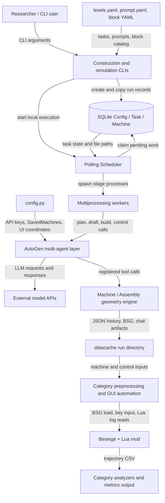

# Codebase Summary: BuildArena

## Overview

BuildArena 0.1.0 是一个面向 LLM/智能体研究者的工程构造基准：模型代理需要规划并搭建 Besiege 机器，再按 Transport、Support、Lift 三类任务和三个难度进行物理仿真评估。代码把语言模型协作、三维几何与碰撞预检、SQLite 任务调度、Besiege 桌面自动化以及轨迹分析串成一条本地流水线；它不是 Web 服务，也没有入站网络 API。README 对“构造阶段不要求启动 Besiege、仿真阶段依赖 Besiege 和 Lua Scripting Mod”的描述与代码一致，但若干默认配置和命令示例与源码存在会影响运行的偏差，详见 Observations。

## Tech Stack

| Layer              | Technology                                                  | Evidence                                                                               |
| ------------------ | ----------------------------------------------------------- | -------------------------------------------------------------------------------------- |
| Language           | Python >=3.12；源码使用 3.12 语法                           | `pyproject.toml`, `spatial/build.py`                                               |
| Agent framework    | Microsoft AutoGen (`autogen-agentchat/core/ext >=0.7.4`)  | `pyproject.toml`, `spatial/agent.py`                                               |
| LLM clients        | OpenAI-compatible clients 与 Anthropic client               | `agents/__init__.py`                                                                 |
| Geometry           | NumPy、numpy-quaternion、Trimesh、python-fcl                | `pyproject.toml`, `spatial/components.py`, `spatial/build.py`                    |
| Database / ORM     | SQLite via SQLModel；每个实验目录一个数据库并启用 WAL       | `scheduler/task_db.py`                                                               |
| Task execution     | `multiprocessing` + `asyncio` + SQLite 轮询             | `scheduler/scheduler.py`, `scheduler/worker.py`                                    |
| Desktop automation | PyAutoGUI、pynput、keyboard、pywin32；macOS 分支使用 Quartz | `pyproject.toml`, `simulation/operations.py`                                       |
| Data analysis      | Pandas、NumPy、Matplotlib                                   | `analyze/sim_common.py`, `analyze/sampling_path_analysis.py`, `spatial/utils.py` |
| Configuration      | PyYAML；根目录 YAML 与用户自建`config.py`                 | `levels.yaml`, `prompt.yaml`, `blocks/configs/`, `README.md`                   |
| Notebook           | Jupyter 教程                                                | `intro.ipynb`, `pyproject.toml`                                                    |
| External runtime   | Besiege 商业游戏 + Lua Scripting Mod                        | `README.md`, `simulation/operations.py`                                            |

`pyproject.toml` 声明 21 个直接依赖，但仓库没有 `uv.lock` 或其他 lockfile，因此实际依赖版本只受下界约束，不能从仓库精确复现。

## Architecture

主入口 `script/run_construction.py` 从 `levels.yaml` 选择一项任务、读取 `prompt.yaml`、用 CLI 指定的模型覆盖代理配置，然后在 `datacache/<project>/` 下建立 SQLite 数据库和配置副本。`Scheduler` 每五秒轮询一次任务表，把普通任务交给最多 `max_workers` 个多进程 worker，并把 Besiege 仿真限制为一次一个。worker 通过 `runners[task.stage]` 执行 `plan -> draft -> build -> refine`，多子结构设计还计划汇合到 `assemble`；Transport 仿真另有最多三轮 `control -> simulation -> feedback`。

代理层由 `spatial.agent.MultiAgents` 管理。planner 生成结构化计划，drafter/reviewer 和 builder/guidance 以 round-robin 协作；builder 调用由 `@operation` 注册的 `Machine`/`Assembly` 工具。`spatial.build` 从积木 YAML 动态建立领域对象，以 Trimesh/FCL 做几何与碰撞检查，并把成功操作保存为可重放 JSON，同时导出 Besiege BSG。数据库只存配置、任务、机器状态和文件路径，聊天记录、计划、操作历史、BSG、控制 JSON 和 CSV 则存放在实验目录，属于 SQLite + 文件系统的混合持久化。

仿真是独立的第二条 CLI 流程：`script/run_simulation.py` 复制构造数据库和机器目录，创建 control/simulation 任务；类别预处理器重建机器并注入 cargo、ballast、追踪标记或控制 Lua，然后 `simulation.operations` 通过桌面坐标操作 Besiege，并从 Lua 日志窗口采集 CSV。分析是第三条独立 CLI 流程，不由 scheduler 自动触发；它根据路径中的类别选择分析器，输出指标 JSON，并可复制通过样本的 BSG。

### Architecture Diagram

## Module Map

### `script/` (`script/`)

面向用户的薄 CLI 层，负责把任务选择、实验目录和调度器连接起来，也提供屏幕坐标校准。

- **Key files**: `run_construction.py` 启动构造采样；`run_simulation.py` 创建并运行仿真副本；`find_coords.py` 校准 GUI 坐标。
- **Internal dependencies**: `agents`, `scheduler`
- **External dependencies**: PyYAML、PyAutoGUI、pynput、keyboard

### `agents/` (`agents/`)

在模块导入时根据 `config.py` 建立模型客户端注册表，供所有 AutoGen 代理按模型名查找。

- **Key files**: `__init__.py` 定义 OpenAI、Google、xAI、DeepSeek、DashScope、Moonshot、Ark 和 Anthropic 客户端。
- **Internal dependencies**: 无；读取仓库外生成的根级 `config.py`
- **External dependencies**: `autogen-ext`, `autogen-core`

### `spatial/` (`spatial/`)

项目的领域核心与代理应用层：表示坐标、朝向、积木和机器，执行碰撞约束、控制配置、操作重放与 BSG/Lua 导出，并将这些操作暴露给多代理会话。

- **Key files**: `build.py` 实现 `Block`/`Machine`/`Assembly`；`components.py` 实现几何值对象；`agent.py` 编排 AutoGen 团队；`utils.py` 提供工具注册和预览。
- **Internal dependencies**: `agents`, `blocks.descriptors`, `scheduler.task_db`
- **External dependencies**: AutoGen、NumPy、numpy-quaternion、Trimesh、python-fcl、Pandas、Matplotlib

### `blocks/` (`blocks/`)

声明 Besiege 可用积木的几何、质量、成本、可连接面、控制 XML 和描述扩展，是 `Machine` 的数据驱动工厂输入。

- **Key files**: `configs/*.yaml` 定义 8 类积木；`descriptors/torch.py` 和 `descriptors/water_cannon.py` 提供动态描述。
- **Internal dependencies**: `spatial.build`, `spatial.utils`
- **External dependencies**: PyYAML（由 `spatial.build` 读取）

### `scheduler/` (`scheduler/`)

以 SQLite 任务图实现可重试的本地流水线：持久化状态、动态产生后继任务、轮询领取任务，并在子进程中路由各阶段。

- **Key files**: `task_db.py` 定义三张表及状态操作；`scheduler.py` 轮询和并发控制；`runner.py` 实现阶段转换；`worker.py` 执行并落盘结果。
- **Internal dependencies**: `spatial.agent`, `simulation`
- **External dependencies**: SQLModel、SQLite、AutoGen、标准库 multiprocessing/asyncio

### `simulation/` (`simulation/`)

按任务类别重建并改造机器，然后通过屏幕和键盘自动化驱动 Besiege、采集并清洗 Lua 轨迹日志。

- **Key files**: `simulation_transport.py`, `simulation_support.py`, `simulation_lift.py`；`operations.py` 实现 GUI 自动化。
- **Internal dependencies**: `spatial.build`, `spatial.components`
- **External dependencies**: Besiege、Lua Scripting Mod、PyAutoGUI、pywin32/Quartz、pynput、pyperclip

### `analyze/` (`analyze/`)

离线分析构造采样路径和三类仿真轨迹，计算任务通过条件、运动指标、token/耗时统计，并输出 CSV/JSON。

- **Key files**: `sim_common.py` 提供公共解析与类别路由；`sim_transport.py`, `sim_support.py`, `sim_lift.py` 实现评分；`sampling_path_analysis.py` 聚合任务图。
- **Internal dependencies**: `spatial.build`, `scheduler.task_db`
- **External dependencies**: Pandas、NumPy

### Root configuration and assets (`.` / `asset/`)

根级 YAML 定义任务协议和代理提示，notebook 演示空间库；`asset/` 保存 README 媒体和 Support 仿真所需的三个 Besiege 自定义关卡。

- **Key files**: `levels.yaml`, `prompt.yaml`, `intro.ipynb`, `asset/support_*.blv`
- **Internal dependencies**: 无
- **External dependencies**: Jupyter、Besiege Level Editor

## API Reference

仓库没有 HTTP/REST、GraphQL、gRPC、WebSocket、Webhook 或外部消息消费者，也没有认证/授权层。以下接口均为本地 CLI、可导入 Python API 或内部后台任务。

### Primary CLI Commands

| Command                                      | Arguments                                                                                                | Handler                                              | Notes                                 |
| -------------------------------------------- | -------------------------------------------------------------------------------------------------------- | ---------------------------------------------------- | ------------------------------------- |
| `uv run -m script.run_construction`        | 必填`--model/-md`, `--category/-c`, `--level/-l`; 可选 `--n_sample/-ns=64`, `--n_worker/-nw=4` | `main` (`script/run_construction.py:50`)         | 主要构造入口                          |
| `uv run -m script.run_simulation`          | `--db/-d` 或 `--todo/-t`; `--rfd/-r`; `--max-workers/-mw=4`; `--resume/-rs`                    | `main` (`script/run_simulation.py:107`)          | `--rfd` 默认已为 true，当前无法关闭 |
| `uv run -m script.find_coords`             | 无参数；交互键`p` 打印、`q` 退出                                                                     | `find_coordinates` (`script/find_coords.py:6`)   | GUI 坐标校准                          |
| `uv run -m analyze.sampling_path_analysis` | `DB_PATH`; `--output/-o=analysis_table.csv`; `--display/-d`                                        | `main` (`analyze/sampling_path_analysis.py:634`) | 构造路径统计                          |
| `uv run -m analyze.sim_common`             | `--csv_path`; `--verbose`                                                                            | `main` (`analyze/sim_common.py:797`)             | 仿真类别路由和分析                    |

### Internal / Debug CLI Commands

| Command                                       | Arguments                                                                    | Handler                                              | Notes                                                |
| --------------------------------------------- | ---------------------------------------------------------------------------- | ---------------------------------------------------- | ---------------------------------------------------- |
| `python -m scheduler.scheduler`             | `--db_path`; 可选 `--timeout`                                            | `Scheduler.run` (`scheduler/scheduler.py:111`)   | 从数据库恢复调度                                     |
| `python -m scheduler.worker`                | `--id`, `--db`                                                           | `test_worker` (`scheduler/worker.py:102`)        | 单任务调试入口                                       |
| `python -m simulation.operations`           | `--name`, `--output_dir`, `--duration`; 可选 `--window_name=Besiege` | `main` (`simulation/operations.py:383`)          | 直接执行 GUI 仿真序列                                |
| `python -m simulation.simulation_transport` | 名义可选`--machine_json`, `--level`                                      | `main` (`simulation/simulation_transport.py:16`) | CLI 缺少实际必需的`control_path`，当前不能独立完成 |
| `python -m simulation.simulation_support`   | 名义可选`--machine_json`, `--level`                                      | `main` (`simulation/simulation_support.py:16`)   | 类别预处理与仿真                                     |
| `python -m simulation.simulation_lift`      | 名义可选`--machine_json`, `--level`                                      | `main` (`simulation/simulation_lift.py:16`)      | 类别预处理与仿真                                     |
| `python -m analyze.sim_transport`           | `--machine_dir`; `--sim_round=1`; `--verbose`                          | `main` (`analyze/sim_transport.py:294`)          | Transport 分析                                       |
| `python -m analyze.sim_support`             | `--machine_dir`; `--sim_round`; `--verbose`                            | `main` (`analyze/sim_support.py:277`)            | Support 分析                                         |
| `python -m analyze.sim_lift`                | `--machine_dir`; `--sim_round`; `--verbose`                            | `main` (`analyze/sim_lift.py:214`)               | Lift 分析                                            |
| `python -m spatial.components`              | 无参数                                                                       | `main` (`spatial/components.py:286`)             | 硬编码几何演示                                       |

`pyproject.toml` 没有 `[project.scripts]` 或 console-script 注册；以上接口都依靠模块执行。

### Spatial Library API

`spatial/__init__.py` 为空且没有 `__all__`，因此没有承诺稳定的包根导出。README 和 `intro.ipynb` 实际展示的主 API 是 `Machine`、`Assembly` 和 `machine_preview`，其中带 `@operation` 的方法同时是 LLM tool surface。

| API                                           | Location                  | Purpose                          |
| --------------------------------------------- | ------------------------- | -------------------------------- |
| `Machine(...)`                              | `spatial/build.py:395`  | 创建可构建、可控制、可导出的机器 |
| `Machine.start(...)`                        | `spatial/build.py:492`  | 初始化 Starting Block            |
| `Machine.reset()`                           | `spatial/build.py:520`  | 清空并重置机器                   |
| `Machine.update_prompt(...)`                | `spatial/build.py:540`  | 汇总机器状态供代理使用           |
| `Machine.get_machine_summary()`             | `spatial/build.py:579`  | 返回机器摘要                     |
| `Machine.get_block_details(block_id)`       | `spatial/build.py:595`  | 查询单个积木详情                 |
| `Machine.shift(shift_real)`                 | `spatial/build.py:613`  | 整体平移                         |
| `Machine.rotate(yaw, pitch, roll)`          | `spatial/build.py:633`  | 整体旋转                         |
| `Machine.connect_blocks(...)`               | `spatial/build.py:688`  | 用 Brace/Winch 连接两个已有面    |
| `Machine.remove_block(block_id)`            | `spatial/build.py:771`  | 删除积木                         |
| `Machine.attach_block_to(...)`              | `spatial/build.py:820`  | 在已有积木面上附加积木           |
| `Machine.twist_block(block_id, angle)`      | `spatial/build.py:909`  | 绕连接法线扭转积木               |
| `Machine.shift_block(block_id, shift_real)` | `spatial/build.py:946`  | 调整积木位置                     |
| `Machine.flip_spin(block_id)`               | `spatial/build.py:979`  | 翻转旋转部件方向                 |
| `Machine.review_powered_blocks()`           | `spatial/build.py:1035` | 列出可控制部件与动作             |
| `Machine.review_control_config()`           | `spatial/build.py:1079` | 查看按键绑定                     |
| `Machine.review_control_sequence()`         | `spatial/build.py:1096` | 查看开环控制序列                 |
| `Machine.change_control_key(...)`           | `spatial/build.py:1119` | 修改动作按键                     |
| `Machine.add_control_sequence(...)`         | `spatial/build.py:1162` | 增加定时按键动作                 |
| `Machine.remove_control_sequence(index)`    | `spatial/build.py:1186` | 删除控制动作                     |
| `Machine.reset_control_sequence()`          | `spatial/build.py:1207` | 清空控制序列                     |
| `Machine.to_file(output_dir)`               | `spatial/build.py:1353` | 导出 BSG 和操作历史 JSON         |
| `Machine.from_file(file_path)`              | `spatial/build.py:1381` | 从操作历史恢复机器               |
| `Machine.rebuild_from_history(...)`         | `spatial/build.py:1402` | 重放操作序列                     |
| `Assembly(...)`                             | `spatial/build.py:1428` | 创建可嵌套多个机器的组合体       |
| `Assembly.add_machine(...)`                 | `spatial/build.py:1447` | 加入子机器/子装配体              |
| `Assembly.remove_machine(machine_index)`    | `spatial/build.py:1530` | 删除子结构                       |
| `Assembly.shift_machine(...)`               | `spatial/build.py:1562` | 平移子结构                       |
| `Assembly.rotate_machine(...)`              | `spatial/build.py:1597` | 旋转子结构                       |
| `machine_preview(machine, cmap)`            | `spatial/utils.py:27`   | 生成 Trimesh 场景预览            |

较低层但可按 Python 命名约定直接导入的类型包括 `Block`、`Connector`、`Pointer`、`Blocks`（`spatial/build.py:40`, `:298`, `:329`, `:350`）以及 `Vector`、`Orientation`、`Geometry`、`Face`（`spatial/components.py:6`, `:51`, `:132`, `:145`）。它们未在 README 中作为稳定 API 承诺。

### Extension Hooks

| API                                                              | Location                                  | Purpose                       |
| ---------------------------------------------------------------- | ----------------------------------------- | ----------------------------- |
| `simulation_transport.main(machine_json, level, control_path)` | `simulation/simulation_transport.py:16` | Transport 预处理、导出与仿真  |
| `simulation_support.main(machine_json, level)`                 | `simulation/simulation_support.py:16`   | Support 预处理、导出与仿真    |
| `simulation_lift.main(machine_json, level)`                    | `simulation/simulation_lift.py:16`      | Lift 预处理、导出与仿真       |
| `run_simulation_sequence(...)`                                 | `simulation/operations.py:163`          | 执行 Besiege GUI/Lua 采集序列 |
| `analyze_simulation_transport(...)`                            | `analyze/sim_transport.py:27`           | 计算 Transport 指标和通过状态 |
| `analyze_simulation_support(...)`                              | `analyze/sim_support.py:20`             | 计算 Support 指标和通过状态   |
| `analyze_simulation_lift(...)`                                 | `analyze/sim_lift.py:23`                | 计算 Lift 指标和通过状态      |
| `route_simulation_analysis(...)`                               | `analyze/sim_common.py:697`             | 按路径类别分派分析器          |
| `generate_sampling_paths(db_path)`                             | `analyze/sampling_path_analysis.py:265` | 从任务图重建采样路径          |
| `generate_analysis_table(db_path)`                             | `analyze/sampling_path_analysis.py:600` | 聚合采样指标表                |

### Background Jobs

| Trigger                    | Handler                                            | Behavior                                                                                                              |
| -------------------------- | -------------------------------------------------- | --------------------------------------------------------------------------------------------------------------------- |
| 构造/仿真 CLI 启动本地循环 | `Scheduler.run` (`scheduler/scheduler.py:111`) | 每五秒领取 SQLite 中的 pending/failed 任务，普通任务多进程并行、simulation 任务串行；没有 cron、Celery 或外部消息队列 |

## Configuration & Environment

代码不读取任何环境变量。README 要求用户在仓库根目录手工创建 `config.py`，其中包含：

- `SavedMachines`: Besiege `SavedMachines` 目录；构造阶段也需要它可写。
- `API_KEY_OAI`, `API_KEY_DS`, `API_KEY_ANT`, `API_KEY_ARC`, `API_KEY_XAI`, `API_KEY_MS`, `API_KEY_ALI`, `API_KEY_GOOGLE`: 第三方模型密钥。
- `POS_OPEN_FOLDER`, `POS_ENTER_NAME`, `POS_OPEN_MACHINE`, `POS_SET_GROUND`, `POS_LOG_WINDOW`, `POS_EMPTY_SPACE`, `POS_START_SIMU`, `POS_DELETE`, `POS_CONFIRM`: 屏幕比例坐标。

仓库内运行时配置包括 `levels.yaml`（九项任务协议）、`prompt.yaml`（代理提示）、`blocks/configs/*.yaml`（积木目录）。每次实验还会在 `datacache/<project>/configs/` 生成配置副本。外部运行服务是所选择的模型 API，以及仿真所需的 Besiege、Steam 安装和 Lua Scripting Mod；SQLite 是本地嵌入式数据库，不是外部服务。

## Build & Deploy

- 安装方式只有 README 中的 `uv sync`；`pyproject.toml` 没有 `[build-system]`、console scripts 或工具配置。
- 仓库没有 lockfile、`requirements.txt`、Dockerfile、Makefile、CI 配置或部署清单。这是研究代码和本地实验工具，不存在服务器部署流程。
- 构造入口可在不启动 Besiege 的情况下工作，但仍需可导入的 `config.py`、有效模型客户端及可写的 `SavedMachines` 路径。
- 仿真在 README 中仅声明验证过 Windows。源码虽有 Quartz/macOS 分支，但 Linux 会落入 Windows 分支并导入 `win32api`，不能视为跨平台。
- 仓库没有测试套件或测试框架配置。本次检查用 Python 3.13 对 28 个 Python 文件执行了字节码编译，语法检查通过；没有运行端到端构造/仿真，因为当前环境未安装完整依赖、未配置模型密钥，也没有 Besiege GUI。

## Observations

1. **默认 Transport 控制流程会在配置读取处失败。** `prompt.yaml:192` 的 `controller` 位于根节点且没有 `model`，但 `spatial/agent.py:369` 读取 `config['agents']['controller']`；`run_construction.py:114` 也只覆盖 `agents` 下的模型。
2. **多子结构装配的 fan-in 状态在现有代码中不可达。** `PlanManager` 等待 `completed + approved=True` 的机器（`scheduler/scheduler.py:25`），而普通 build 写 `completed + approved=False`，refine 写 `unverified + approved=True`；仓库没有 verify stage 把后者推进到目标状态。
3. **缺省模型密钥会造成导入风险。** `agents/__init__.py` 只在 Google/xAI key 为真时定义对应 client dict，却在第 169 行无条件合并；任一空 key 都可能触发 `NameError`。占位字符串虽然为真，但会推迟到首次请求时认证失败。
4. **密钥文件管理不安全。** 必需的 `config.py` 不在仓库，也没有被 `.gitignore` 忽略，用户按 README 填入真实密钥后容易误提交。
5. **README 有两处命令偏差。** 仿真入口实际需要原始 `task_database.db` 并自行创建 `simulation_database.db`，README 却示例传后者；构造分析示例多写了一个字面量 `db_path`。
6. **部分接口契约不一致。** Transport 独立仿真 CLI 没有暴露实际必需的 `control_path`；`route_simulation_analysis()` 标注返回 `Dict`，但执行后没有返回 `result`；`--rfd` 使用 `store_true` 且默认 true，无法通过 CLI 关闭。
7. **依赖清单不完整且有冗余。** 源码直接导入未声明的 `numpy`、`pyperclip` 和 macOS Quartz；Flask、Pillow、SciPy、Seaborn 未在源码/notebook 中使用，`pywin32` 也没有 Windows platform marker。
8. **可维护性上的优点。** 积木目录、任务和提示均数据化；机器以 command history 可重放；SQLite 保存任务 lineage 和失败重试；几何约束、类别仿真与指标分析均有清晰模块边界。
9. **横切能力较轻。** 没有标准 `logging`、类型检查或自动测试；日志主要靠 `print`，但 LLM 对话、操作历史、objection、任务错误和结果文件会完整落盘，便于实验追溯。

建议新工程师先从 `script/run_construction.py:50`、`scheduler/scheduler.py:94`、`scheduler/runner.py:20`、`spatial/agent.py:131` 和 `spatial/build.py:395` 阅读，再进入仿真与分析模块。
