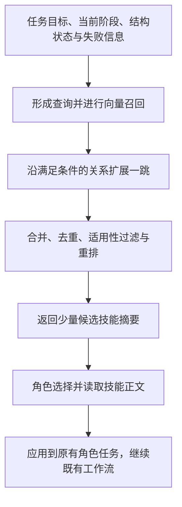

# BuildArena 工程 Skill：研究思路与实施规划

更新日期：2026-09-14。

本文记录已讨论的研究方向、首版范围与实验安排。接口名称、检索参数和数据字段属于实现草案，具体选择通过后续小规模实验确定。

## 1. 核心目标

在 BuildArena 原有多智能体工作流上，加入共享、只读的工程技能库，通过“向量召回＋关系图扩展”按需提供知识，研究同一 Qwen 模型和可比预算下的性能提升。

- 目标模型：Qwen3.8-Max；当前仓库已配置 `qwen3.8-max-0902`，正式实验固定具体请求标识与模型设置。
- 首个任务方向：Support，覆盖桥梁跨越、接触支承、中央承载、结构稳定性和模块组合。
- 主要目标：提高构建完成率、任务成功率与物理性能，同时衡量 token、耗时和运行成本。
- 扩展方向：在 Support 上建立有效性证据后，逐步扩展到 Transport 和其他任务。

需要验证的研究假设：

1. 工程知识经过技能化整理后，可以帮助现有角色做出更合适的设计和构建决策。
2. 按需检索可以在有限上下文预算内提供相关知识。
3. 有类型的技能关系可以补充前置条件、组合部件和修复知识，改善纯向量检索的效果。

上述收益均通过实验判断。

## 2. 首版范围与控制变量

| 方面 | 首版安排 |
| --- | --- |
| Agent 工作流 | 保留原有角色、职责、阶段顺序和阶段间交接方式 |
| 操作能力 | 保留现有积木工具和构建操作权限 |
| Skill 形式 | 结构化知识、设计原则、操作指导和检查清单 |
| Skill 接入 | 角色共用一套技能库和只读接口，按当前任务自主查询和读取 |
| 检索组织 | 向量召回作为基础，带类型的一跳图扩展作为独立增量 |
| 评测环境 | 保持任务定义、仿真环境和评价标准一致 |
| 后续扩展 | 参数化部件、可执行宏、技能自动维护和跨任务在线学习分别研究 |

首轮先比较整体接入效果。角色开关作为后续消融配置，用于研究技能在规划、蓝图细化、构建纠错等环节的贡献。下游角色会继续接收受技能影响的方案与蓝图，因此角色消融衡量的是接入位置及其传播效果。

## 3. 书籍到技能的离线流程

流程：选择相关章节 → 提取原则与步骤 → 映射到 Besiege 环境 → 人工审核 → 几何检查与局部仿真 → 冻结技能版本。

### 来源与审核

- 候选资料、官方获取入口和许可审核项见 [book_candidates.md](book_candidates.md)。
- 第一批建议审核 S01《Engineering Statics: Open and Interactive》和 S02《Structural Analysis》。
- S03 的材料力学模块作为补充，S04 为中文主教材备选。
- 原始文件放入 `skill/books/`；该目录中的原书默认由 Git 忽略。
- 提炼前记录实际版本、文件标识、所选章节、来源页码和许可信息。

### 环境适配

Support 的三个难度对应 5、10、20 个游戏单位的跨度，采用桥梁与地形接触、货物与桥梁接触的放置方式，以及中央逐渐加载。Soft 使用一个子结构，Medium/Hard 最多使用三个子结构，具体定义以 `levels.yaml` 为准。

技能需显式记录支承方式、连接模型、坐标系、积木能力和加载条件。书籍中的理想铰接、连续梁、材料参数等假设需要逐项映射；定性趋势和定量公式分别记录适用范围。

人工审核记录表达与来源质量；几何检查记录构建合法性；物理仿真记录特定条件下的性能。三类证据分别保存。

## 4. 单条技能的内容草案

| 字段 | 内容 |
| --- | --- |
| `id`、`title`、`summary` | 稳定标识、名称和简短检索描述 |
| `applicability` | 适用任务、阶段、场景与触发条件 |
| `prerequisites` | 使用前提、所需状态信息及环境条件 |
| `procedure` | 原则、分析步骤和操作指导 |
| `checklist` | 使用前后的检查事项 |
| `environment_constraints` | Besiege 积木、连接方式、任务约束和单位说明 |
| `sources` | 书籍版本、章节、页码与必要的来源定位信息 |
| `version`、`validation` | 技能版本、人工审核状态、测试条件和验证记录 |

第一批目标为 5–10 条粒度清晰的技能，例如支承条件检查、整体受力分析、几何稳定性检查、桁架布局、梁变形风险和接触滑移检查。具体边界由原文阅读与环境适配结果决定。

## 5. 技能图与检索设计

### 关系组织

技能库采用带类型的有向关系图。树状层级通过“通用技能—专门技能”关系表达，跨分支关系用于依赖、组合和修复。

| 关系 | 方向约定 | 使用条件 |
| --- | --- | --- |
| `requires` | 技能 → 前置技能 | 当前前提需要补齐或核对 |
| `uses` | 方案技能 → 部件或辅助技能 | 当前方案需要对应部件或步骤 |
| `specializes` | 专门技能 → 通用技能 | 专门技能适配当前场景，或需要回溯通用原则 |
| `repaired_by` | 技能 → 修复技能 | 当前已观察到对应失败 |

每条边至少记录起点、终点、关系类型和建立理由；按需补充触发条件。专门化关系支持反向查询，以便从通用技能定位匹配场景的专门技能。

初版用 JSON 保存人工审定的关系，并采用固定的一跳扩展规则。

### 检索流程



初始设置建议：向量召回 Top-5，图扩展一跳，最终读取 2–3 条技能。候选上限、读取次数和总上下文预算在实现时明确配置，并在实验中保持一致。

重排共同考虑语义相关性、关系用途、适用条件、验证状态与上下文成本。必要前置技能需要通过规则获得合理位置；关系扩展的理由记录到检索日志。

向量模型、查询字段和重排策略属于待确认项，初版优先采用容易复现的固定配置。

## 6. 共享接口与工作流接入

接口草案：

- `search_skills(query)`：返回候选技能 ID、摘要、适用条件和召回或图扩展理由。
- `read_skill(skill_id)`：返回指定版本的完整技能内容。

目录、正文与关系图在一次实验期间冻结。接口只读取技能资料，知识访问与构建操作权限分别管理。技能读取后的适用性判断和具体应用由原有角色完成。

接入安排：

1. 通过可关闭的配置向角色提供统一只读工具与简短使用说明。
2. 保留原有角色工具，统一合并技能工具与现有工具后完成绑定。
3. 角色读取技能后继续产出符合原有格式的计划、蓝图或操作指导。
4. 跨阶段传递已经应用到当前任务的结论，完整技能正文保留在读取角色的上下文与日志中。
5. 技能关闭时沿用原有提示词、工具配置和执行路径。

仓库接入注意点：

- `spatial/agent.py` 的工具绑定辅助函数会重新创建 Agent，合并工具时需保留现有 objection 等能力。
- Planner 的最终输出会被解析为 `<building_plan>`，工具读取后的继续生成行为与最终格式需要验证。
- `scheduler/runner.py` 按 `sub_structures` 创建 Draft 任务，后续需要使用的技能结论应写入对应子结构字段。
- 工作流已有终止标记，技能正文和工具返回值需要检查保留标记的意外触发风险。
- 额外的工具调用、读取内容和读取后的模型推理均计入实验成本。

## 7. 对照实验与评价

| 组别 | 配置 | 主要研究问题 |
| --- | --- | --- |
| A | 原始工作流 | 基线表现 |
| B | 按预先固定规则直接提供技能内容 | 技能知识本身的收益 |
| C | 通过向量检索按需读取技能 | 知识选择与按需加载的效果 |
| D | 向量检索＋一跳图扩展 | 技能关系的增量收益 |

### 公平性与复现

- 固定模型请求标识、thinking 设置、采样参数、重试规则和预算上限。
- 固定任务、评价标准、仿真次数与环境版本，记录实际调用与资源消耗。
- B/C/D 使用同一版本技能库，明确各组知识选择规则和上下文预算。
- C/D 共享向量模型、索引和候选筛选配置，将图扩展作为主要变化。
- 书籍整理、技能生成、人工标注和离线仿真成本单列。
- 开发与正式评测采用预先划定的任务或参数组合；正式评测前冻结技能库、提示词和检索设置。
- 原始阶段重试、同一机器的控制反馈轮次和诊断仿真分别记录，样本数按独立构建尝试统计。

### 指标与日志

主要结果：构建完成率、任务成功率、承载等物理指标、积木成本、token 与耗时。

过程诊断：非法操作、设计或几何失败、物理失败、运行基础设施错误分别统计；未测量、已测量失败和被拒绝构建分别记录。

技能日志至少保留任务 ID、角色、查询、候选集合、扩展边及理由、实际读取技能与版本、返回内容、最终阶段输出和调用成本。技能读取记录与技能的实际应用证据分别分析。

先用小规模独立重复实验定位问题，再按预算扩大样本并报告不确定性。后续追加角色接入位置消融、书籍来源消融和跨任务迁移实验。

## 8. 分阶段实施

| 阶段 | 工作 | 验收标准 |
| --- | --- | --- |
| P0：资料准备 | 书目筛选、人工审核、原书下载、章节选择 | 每份入选资料有版本与来源记录 |
| P1：技能初版 | 提炼 5–10 条 Support 技能，完成环境映射与审核 | 技能有清晰边界、来源页码、适用条件和验证状态 |
| P2：基础接入 | 实现共享读取接口、配置开关和调用日志，运行 A/B | 技能关闭路径与原流程一致，开启后输出协议有效 |
| P3：向量检索 | 实现候选摘要召回与按需读取，运行 C | 查询、候选、读取内容和预算可追溯 |
| P4：图扩展 | 标注少量关系，实现一跳扩展，运行 D | 可以在相同预算约束下比较 C/D 的差异 |
| P5：分析扩展 | 汇总收益与失败类型，开展角色消融或新任务迁移 | 形成可解释、可复现的实验结论 |

## 9. 项目存放与当前进度

当前目录（2026-09-14 接入后）：

```text
skill/
  README.md
  PLAN.md
  book_candidates.md
  EXTRACT_PROMPT.md
  __init__.py
  library.py
  drafts/
    support_*.md
    relations.json
  books/
    .gitignore
```

技能内容、关系数据、检索和接口代码统一放在 `skill/` 下。批处理对照入口为 `script/run_skill_comparison.py`。

截至本次整理：

- 已完成：从本地 `statics.pdf` 提炼五条 Support 草案，实际通过 51 个纯函数断言。
- 已完成：只读检索/读取接口、Planner 专用开关、有界工具循环、XML 交接、版本快照、逐调用日志与成对实验脚本。
- 首版检索：本地 TF-IDF 词法向量，英文词项与中文双字词项；不是语义 embedding，不把它视为完整的语义检索组 C。
- 当前控制：Top-5，最多两次搜索、两次读取、20,000 字符成功知识响应预算；待审核关系不扩展。
- 待审核：来源与技能的人工审核、几何和物理适用性。探索性实验必须显式允许草案。
- 待实施：语义 embedding、审定的一跳图扩展、固定注入组 B、正式多样本 A/B/C/D 消融。

复现接口与当前对照命令见 `skill/README.md`。本轮先执行 Support Soft 有/无 Planner 技能的小样本开发对照；构建完成与物理成功分开统计，不因接口接通而声明知识有效。
